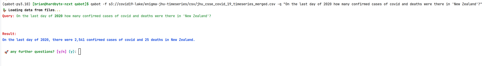

# qabot

Query local or remote files with natural language queries powered by
OpenAI's `gpt` and `duckdb` 🦆.

Can query Wikidata and local files.

## Command Line Usage

```bash
$ EXPORT OPENAI_API_KEY=sk-...
$ EXPORT QABOT_MODEL_NAME=gpt-4
$ qabot -w -q "How many Hospitals are there located in Beijing"
Query: How many Hospitals are there located in Beijing
There are 39 hospitals located in Beijing.
Total tokens 1749 approximate cost in USD: 0.05562
```

## Python Usage

```python
from qabot import ask_wikidata, ask_file

print(ask_wikidata("How many hospitals are there in New Zealand?"))
print(ask_file("How many men were aboard the titanic?", 'data/titanic.csv'))
```

Output:
```text
There are 54 hospitals in New Zealand.
There were 577 male passengers on the Titanic.
```


## Features

Works on local CSV files:


remote CSV files:

```
$ qabot -f https://duckdb.org/data/holdings.csv -q "Tell me how many Apple holdings I currently have"
 🦆 Creating local DuckDB database...
 🦆 Loading data...
create view 'holdings' as select * from 'https://duckdb.org/data/holdings.csv';
 🚀 Sending query to LLM
 🧑 Tell me how many Apple holdings I currently have


 🤖 You currently have 32.23 shares of Apple.


This information was obtained by summing up all the Apple ('APPL') shares in the holdings table.

SELECT SUM(shares) as total_shares FROM holdings WHERE ticker = 'APPL'
```

Even on (public) data stored in S3:



You can even load data from disk/URL via the natural language query:


```
qabot -q "Load the file 'data/titanic.csv' into a table called 'raw_passengers'. Create a view of the raw passengers table for just the male passengers. What was the average fare for surviving male passengers?" -v
 🦆 Creating local DuckDB database...
 🤖 Using model: gpt-3.5-turbo. Max LLM/function iterations before answer 20
 🚀 Sending query to LLM
 🧑 Load the file 'data/titanic.csv' into a table called 'raw_passengers'. Create a view of the raw passengers table for just the male passengers. What was the average fare for surviving male passengers?
 🤖 load_data
{'files': ['data/titanic.csv']}
 🦆 Imported with SQL:
["create table 'titanic' as select * from 'data/titanic.csv';"]
 🤖 show_tables
 🦆 name
qabot_queries
titanic
 🤖 describe_table
{'table': 'titanic'}
 🦆 titanic
column_name,data_type
PassengerId,BIGINT
Survived,BIGINT
Pclass,BIGINT
Name,VARCHAR
Sex,VARCHAR
Age,DOUBLE
SibSp,BIGINT
Parch,BIGINT
Ticket,VARCHAR
Fare,DOUBLE
Cabin,VARCHAR
Embarked,VARCHAR
select count(*) from 'titanic';
count_star()
891
select * from 'titanic' limit 3;
PassengerId,Survived,Pclass,Name,Sex,Age,SibSp,Parch,Ticket,Fare,Cabin,Embarked
1,0,3,Braund, Mr. Owen Harris,male,22.0,1,0,A/5 21171,7.25,None,S
2,1,1,Cumings, Mrs. John Bradley (Florence Briggs Thayer),female,38.0,1,0,PC 17599,71.2833,C85,C
3,1,3,Heikkinen, Miss. Laina,female,26.0,0,0,STON/O2. 3101282,7.925,None,S
 🤖 execute_sql
{'query': "CREATE VIEW male_passengers AS SELECT * FROM titanic WHERE Sex = 'male'"}
 🦆 No output
 🤖 describe_table
{'table': 'male_passengers'}
 🦆 male_passengers
column_name,data_type
PassengerId,BIGINT
Survived,BIGINT
Pclass,BIGINT
Name,VARCHAR
Sex,VARCHAR
Age,DOUBLE
SibSp,BIGINT
Parch,BIGINT
Ticket,VARCHAR
Fare,DOUBLE
Cabin,VARCHAR
Embarked,VARCHAR
select count(*) from 'male_passengers';
count_star()
577
select * from 'male_passengers' limit 3;
PassengerId,Survived,Pclass,Name,Sex,Age,SibSp,Parch,Ticket,Fare,Cabin,Embarked
1,0,3,Braund, Mr. Owen Harris,male,22.0,1,0,A/5 21171,7.25,None,S
5,0,3,Allen, Mr. William Henry,male,35.0,0,0,373450,8.05,None,S
6,0,3,Moran, Mr. James,male,None,0,0,330877,8.4583,None,Q
 🤖 execute_sql
{'query': 'SELECT AVG(Fare) AS average_fare FROM male_passengers WHERE Survived = 1'}
 🦆 average_fare
40.82148440366974
 🦆 {'summary': 'The average fare for surviving male passengers was $40.82.', 'detail': "To calculate the average fare for surviving male passengers, I created a view called 'male_passengers' that contains only the male passengers from the 'titanic' 
table. Then, I executed the SQL query `SELECT AVG(Fare) AS average_fare FROM male_passengers WHERE Survived = 1` to calculate the average fare for the surviving male passengers."}


 🚀 Question:
 🧑 Load the file 'data/titanic.csv' into a table called 'raw_passengers'. Create a view of the raw passengers table for just the male passengers. What was the average fare for surviving male passengers?
 🤖 The average fare for surviving male passengers was $40.82.


To calculate the average fare for surviving male passengers, I created a view called 'male_passengers' that contains only the male passengers from the 'titanic' table. Then, I executed the SQL query `SELECT AVG(Fare) AS average_fare FROM 
male_passengers WHERE Survived = 1` to calculate the average fare for the surviving male passengers.

```

## Quickstart

You need to set the `OPENAI_API_KEY` environment variable to your OpenAI API key, 
which you can get from [here](https://platform.openai.com/account/api-keys).

Install the `qabot` command line tool using pip/poetry:


```bash
$ pip install -U qabot
```

Then run the `qabot` command with either local files (`-f my-file.csv`) or `-w` to query wikidata.


## Examples

### Local CSV file/s

```bash
$ qabot -q "how many passengers survived by gender?" -f data/titanic.csv
🦆 Loading data from files...
Loading data/titanic.csv into table titanic...

Query: how many passengers survived by gender?
Result:
There were 233 female passengers and 109 male passengers who survived.


 🚀 any further questions? [y/n] (y): y

 🚀 Query: what was the largest family who did not survive? 
Query: what was the largest family who did not survive?
Result:
The largest family who did not survive was the Sage family, with 8 members.

 🚀 any further questions? [y/n] (y): n
```


## Query WikiData

Use the `-w` flag to query wikidata. For best results use the `gpt-4` model.
```bash
$ EXPORT QABOT_MODEL_NAME=gpt-4
$ qabot -w -q "How many Hospitals are there located in Beijing"
```

## Intermediate steps and database queries

Use the `-v` flag to see the intermediate steps and database queries.
Sometimes it takes a long route to get to the answer, but it's interesting to see how it gets there.

```
qabot -f data/titanic.csv -q "how many passengers survived by gender?" -v
```

## Data accessed via http/s3

Use the `-f <url>` flag to load data from a url, e.g. a csv file on s3:

```bash
$ qabot -f s3://covid19-lake/enigma-jhu-timeseries/csv/jhu_csse_covid_19_timeseries_merged.csv -q "how many confirmed cases of covid are there?" -v
🦆 Loading data from files...
create table jhu_csse_covid_19_timeseries_merged as select * from 's3://covid19-lake/enigma-jhu-timeseries/csv/jhu_csse_covid_19_timeseries_merged.csv';

Result:
264308334 confirmed cases
```


## Ideas

- streaming mode to output results as they come in
- token limits
- Supervisor agent - assess whether a query is "safe" to run, could ask for user confirmation to run anything that gets flagged.
- Often we can zero-shot the question and get a single query out - perhaps we try this before the MKL chain
- test each zeroshot agent individually
- Generate and pass back assumptions made to the user
- Add an optional "clarify" tool to the chain that asks the user to clarify the question
- Create a query checker tool that checks if the query looks valid and/or safe
- Inject AWS credentials into duckdb so we can access private resources in S3

- Automatic publishing to pypi. Look at https://blog.pypi.org/posts/2023-04-20-introducing-trusted-publishers/