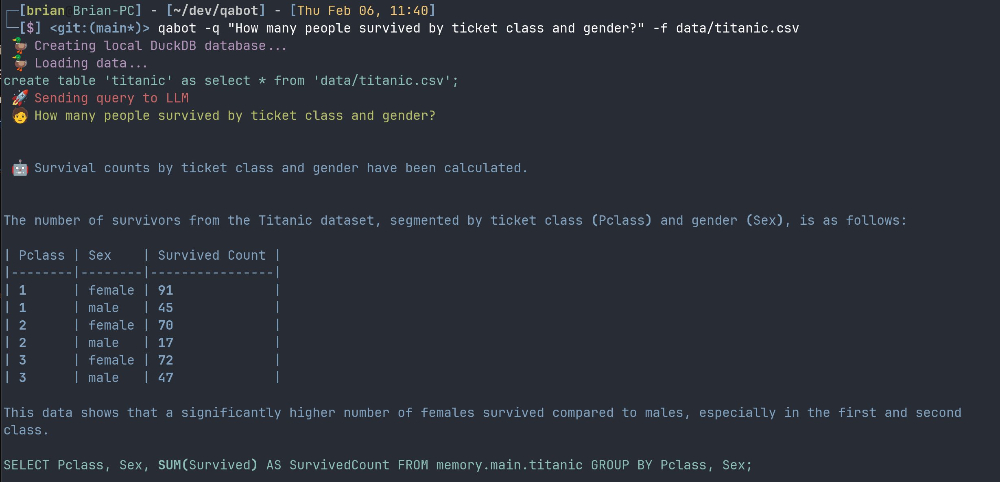

# qabot

Query local or remote files with natural language queries powered by
`langchain` and `gpt-3.5-turbo` and `duckdb` 🦆.

Works on local CSV files:



remote CSV files:

```
$ qabot \
    -f https://www.stats.govt.nz/assets/Uploads/Environmental-economic-accounts/Environmental-economic-accounts-data-to-2020/renewable-energy-stock-account-2007-2020-csv.csv \
    -q "How many Gigawatt hours of generation was there for Solar resources in 2015 through to 2020?"
```


Even on (public) data stored in S3:


## Quickstart

You need to set the `OPENAI_API_KEY` environment variable to your OpenAI API key, 
which you can get from [here](https://platform.openai.com/account/api-keys).

Install the `qabot` command line tool using pip/poetry:


```bash
$ pip install qabot
```

Then run the `qabot` command with either local files (`-f my-file.csv`) or a database connection string.

Note if you want to use a database, you will need to install the relevant drivers, 
e.g. `pip install psycopg2-binary` for postgres.


## Examples

### Local CSV file/s

```bash
$ qabot -q "how many passengers survived by gender?" -f data/titanic.csv
🦆 Loading data from files...
Loading data/titanic.csv into table titanic...

Query: how many passengers survived by gender?
Result:
There were 233 female passengers and 109 male passengers who survived.


 🚀 any further questions? [y/n] (y): y

 🚀 Query: what was the largest family who did not survive? 
Query: what was the largest family who did not survive?
Result:
The largest family who did not survive was the Sage family, with 8 members.

 🚀 any further questions? [y/n] (y): n
```


## Intermediate steps and database queries

Use the `-v` flag to see the intermediate steps and database queries.

Sometimes it takes a long route to get to the answer, but it's interesting to see how it gets there:


```
qabot -f data/titanic.csv -q "how many passengers survived by gender?" -v
🦆 Loading data from files...
Query: how many passengers survived by gender?
I need to check the columns in the 'titanic' table to see which ones contain gender and survival information.
Action: Describe Table
Action Input: titanic

Observation: titanic

┌─────────────┬─────────────┬─────────┬─────────┬─────────┬───────┐
│ column_name │ column_type │  null   │   key   │ default │ extra │
│   varchar   │   varchar   │ varchar │ varchar │ varchar │ int32 │
├─────────────┼─────────────┼─────────┼─────────┼─────────┼───────┤
│ PassengerId │ BIGINT      │ YES     │ NULL    │ NULL    │  NULL │
│ Survived    │ BIGINT      │ YES     │ NULL    │ NULL    │  NULL │
│ Pclass      │ BIGINT      │ YES     │ NULL    │ NULL    │  NULL │
│ Name        │ VARCHAR     │ YES     │ NULL    │ NULL    │  NULL │
│ Sex         │ VARCHAR     │ YES     │ NULL    │ NULL    │  NULL │
│ Age         │ DOUBLE      │ YES     │ NULL    │ NULL    │  NULL │
│ SibSp       │ BIGINT      │ YES     │ NULL    │ NULL    │  NULL │
│ Parch       │ BIGINT      │ YES     │ NULL    │ NULL    │  NULL │
│ Ticket      │ VARCHAR     │ YES     │ NULL    │ NULL    │  NULL │
│ Fare        │ DOUBLE      │ YES     │ NULL    │ NULL    │  NULL │
│ Cabin       │ VARCHAR     │ YES     │ NULL    │ NULL    │  NULL │
│ Embarked    │ VARCHAR     │ YES     │ NULL    │ NULL    │  NULL │
├─────────────┴─────────────┴─────────┴─────────┴─────────┴───────┤
│ 12 rows                                               6 columns │
└─────────────────────────────────────────────────────────────────┘

I need to create a view that only includes the columns I need for this question.
Action: Data Op
Action Input: 
        CREATE VIEW titanic_gender_survival AS
        SELECT Sex, Survived
        FROM titanic
Thought:

> Entering new AgentExecutor chain...
This is a valid SQL query creating a view. We can execute it directly.
Action: execute
Action Input: 
        CREATE VIEW titanic_gender_survival AS
        SELECT Sex, Survived
        FROM titanic
Observation: No output
Thought:The view has been created successfully. We can now query it.
Action: execute
Action Input: SELECT * FROM titanic_gender_survival LIMIT 5
Observation: 
┌─────────┬──────────┐
│   Sex   │ Survived │
│ varchar │  int64   │
├─────────┼──────────┤
│ male    │        0 │
│ female  │        1 │
│ female  │        1 │
│ female  │        1 │
│ male    │        0 │
└─────────┴──────────┘

Thought:The view has been created successfully and we can see the first 5 rows of the view. The final answer is the first 5 rows of the titanic_gender_survival view, showing the sex and survival status of passengers on the 
Titanic.
Final Answer: 
┌─────────┬──────────┐
│   Sex   │ Survived │
│ varchar │  int64   │
├─────────┼──────────┤
│ male    │        0 │
│ female  │        1 │
│ female  │        1 │
│ female  │        1 │
│ male    │        0 │
└─────────┴──────────┘

> Finished chain.

Observation: ┌─────────┬──────────┐
│   Sex   │ Survived │
│ varchar │  int64   │
├─────────┼──────────┤
│ male    │        0 │
│ female  │        1 │
│ female  │        1 │
│ female  │        1 │
│ male    │        0 │
└─────────┴──────────┘
I need to group the data by gender and count the number of survivors for each group.
Action: Data Op
Action Input: 
        SELECT Sex, SUM(Survived) AS num_survived
        FROM titanic_gender_survival
        GROUP BY Sex
Thought:

> Entering new AgentExecutor chain...
We need to check if the table titanic_gender_survival exists and if it has the columns Sex and Survived.
Action: Describe Table
Action Input: titanic_gender_survival
Observation: titanic_gender_survival

┌─────────────┬─────────────┬─────────┬─────────┬─────────┬───────┐
│ column_name │ column_type │  null   │   key   │ default │ extra │
│   varchar   │   varchar   │ varchar │ varchar │ varchar │ int32 │
├─────────────┼─────────────┼─────────┼─────────┼─────────┼───────┤
│ Sex         │ VARCHAR     │ YES     │ NULL    │ NULL    │  NULL │
│ Survived    │ BIGINT      │ YES     │ NULL    │ NULL    │  NULL │
└─────────────┴─────────────┴─────────┴─────────┴─────────┴───────┘

Thought:The table titanic_gender_survival exists and has the columns Sex and Survived. We can now run the query.
Action: execute
Action Input: 
```
SELECT Sex, SUM(Survived) AS num_survived
FROM titanic_gender_survival
GROUP BY Sex
LIMIT 5
```

Observation: 
┌─────────┬──────────────┐
│   Sex   │ num_survived │
│ varchar │    int128    │
├─────────┼──────────────┤
│ male    │          109 │
│ female  │          233 │
└─────────┴──────────────┘

Thought:The query returned the number of survivors grouped by gender. The table titanic_gender_survival has been used. 
Final Answer: The number of survivors grouped by gender are: 
- 109 males survived
- 233 females survived.

> Finished chain.

Observation: The number of survivors grouped by gender are: 
- 109 males survived
- 233 females survived.
Intermediate Steps: 
  Step 1

    Describe Table
      titanic

      titanic

    ┌─────────────┬─────────────┬─────────┬─────────┬─────────┬───────┐
    │ column_name │ column_type │  null   │   key   │ default │ extra │
    │   varchar   │   varchar   │ varchar │ varchar │ varchar │ int32 │
    ├─────────────┼─────────────┼─────────┼─────────┼─────────┼───────┤
    │ PassengerId │ BIGINT      │ YES     │ NULL    │ NULL    │  NULL │
    │ Survived    │ BIGINT      │ YES     │ NULL    │ NULL    │  NULL │
    │ Pclass      │ BIGINT      │ YES     │ NULL    │ NULL    │  NULL │
    │ Name        │ VARCHAR     │ YES     │ NULL    │ NULL    │  NULL │
    │ Sex         │ VARCHAR     │ YES     │ NULL    │ NULL    │  NULL │
    │ Age         │ DOUBLE      │ YES     │ NULL    │ NULL    │  NULL │
    │ SibSp       │ BIGINT      │ YES     │ NULL    │ NULL    │  NULL │
    │ Parch       │ BIGINT      │ YES     │ NULL    │ NULL    │  NULL │
    │ Ticket      │ VARCHAR     │ YES     │ NULL    │ NULL    │  NULL │
    │ Fare        │ DOUBLE      │ YES     │ NULL    │ NULL    │  NULL │
    │ Cabin       │ VARCHAR     │ YES     │ NULL    │ NULL    │  NULL │
    │ Embarked    │ VARCHAR     │ YES     │ NULL    │ NULL    │  NULL │
    ├─────────────┴─────────────┴─────────┴─────────┴─────────┴───────┤
    │ 12 rows                                               6 columns │
    └─────────────────────────────────────────────────────────────────┘

    

  Step 2

    Data Op
      CREATE VIEW titanic_gender_survival AS
            SELECT Sex, Survived
            FROM titanic

      ┌─────────┬──────────┐
    │   Sex   │ Survived │
    │ varchar │  int64   │
    ├─────────┼──────────┤
    │ male    │        0 │
    │ female  │        1 │
    │ female  │        1 │
    │ female  │        1 │
    │ male    │        0 │
    └─────────┴──────────┘

    

  Step 3

    Data Op
      SELECT Sex, SUM(Survived) AS num_survived
            FROM titanic_gender_survival
            GROUP BY Sex

      The number of survivors grouped by gender are: 
    - 109 males survived
    - 233 females survived.

    


Thought:


Result:
109 males and 233 females survived.
```

## Data accessed via http/s3

Use the `-f <url>` flag to load data from a url, e.g. a csv file on s3:

```bash
$ qabot -f s3://covid19-lake/enigma-jhu-timeseries/csv/jhu_csse_covid_19_timeseries_merged.csv -q "how many confirmed cases are there" -v
🦆 Loading data from files...
create table jhu_csse_covid_19_timeseries_merged as select * from 's3://covid19-lake/enigma-jhu-timeseries/csv/jhu_csse_covid_19_timeseries_merged.csv';

Result:
264308334 confirmed cases
```

## Links

- [Python library docs](https://langchain.readthedocs.io)
- [Agent docs to talk to arbitrary apis via OpenAPI/Swagger](https://langchain.readthedocs.io/en/latest/modules/agents/agent_toolkits/openapi.html)
- [Agents/Tools to talk SQL](https://langchain.readthedocs.io/en/latest/modules/agents/agent_toolkits/sql_database.html)
- [Typescript library](https://hwchase17.github.io/langchainjs/docs/overview/)

